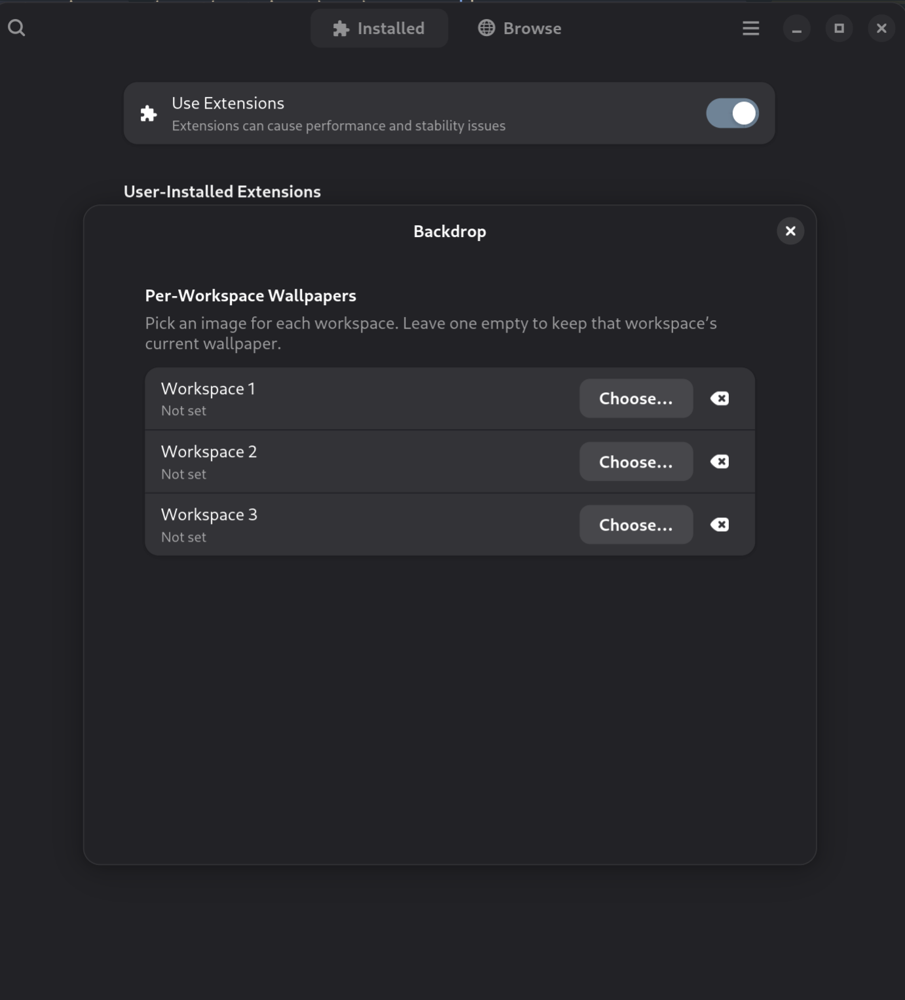

# Backdrop

**A different desktop wallpaper for each workspace.** A small, focused GNOME Shell
extension: pick one image per workspace, and Backdrop swaps the wallpaper as you
move between them.

GNOME does not do this natively, and the older per-workspace extensions stopped
working on modern GNOME. Backdrop is a clean, GNOME 48+ implementation using the
current (ESM) extension model.



## Features

- One wallpaper per workspace, chosen from a simple settings window.
- Applies to both the light and dark wallpaper slots.
- Leave a workspace empty to keep its current wallpaper untouched.
- Tiny and dependency-free — it just listens for workspace changes and updates
  `org.gnome.desktop.background`.
- Works on Wayland (the logic runs inside the shell, not as an external poller).

## Requirements

- GNOME Shell **48** (Wayland or X11).

## Install

### From source

```bash
git clone https://github.com/c-sprinks/backdrop.git
cd backdrop

# compile the settings schema
glib-compile-schemas schemas/

# install into your local extensions directory
mkdir -p ~/.local/share/gnome-shell/extensions
cp -r . ~/.local/share/gnome-shell/extensions/backdrop@c-sprinks.github.io
```

Then log out and back in (required to load a new extension on Wayland) and enable it:

```bash
gnome-extensions enable backdrop@c-sprinks.github.io
```

## Usage

Open the extension's settings — from the **Extensions** app, or:

```bash
gnome-extensions prefs backdrop@c-sprinks.github.io
```

You'll get one row per workspace. Click **Choose…** to pick an image for that
workspace, or **Clear** to blank a workspace so its wallpaper is left untouched.
Use the **＋** button in the header to add slots for more workspaces, and the
**−** button on the last row to remove one. Switch workspaces and the wallpaper
follows your configuration.

## How it works

`extension.js` connects to the shell's `active-workspace-changed` signal. On each
switch (and once at enable time) it reads the active workspace index, looks up the
matching URI from its GSettings list, and writes it to
`org.gnome.desktop.background`. That's the entire mechanism — about 40 lines.

`prefs.js` is a libadwaita settings window that binds a file picker per workspace
to the same GSettings list.

## Known limitations

- In the **Activities overview**, all workspace thumbnails show the *current*
  wallpaper (they update on switch, not all at once). Cosmetic only.
- Preferences pre-fills a row per configured workspace; use the **＋**/**−**
  buttons to match however many workspaces you use. This is handy with **dynamic
  workspaces**, where the live count isn't visible to the settings window — the
  mapping is always by index (workspace 1 = first entry, and so on).

## Building a zip

```bash
gnome-extensions pack --force
```

## License

[GPL-2.0-or-later](LICENSE). © 2026 Chris Sprinkles.
